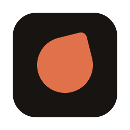
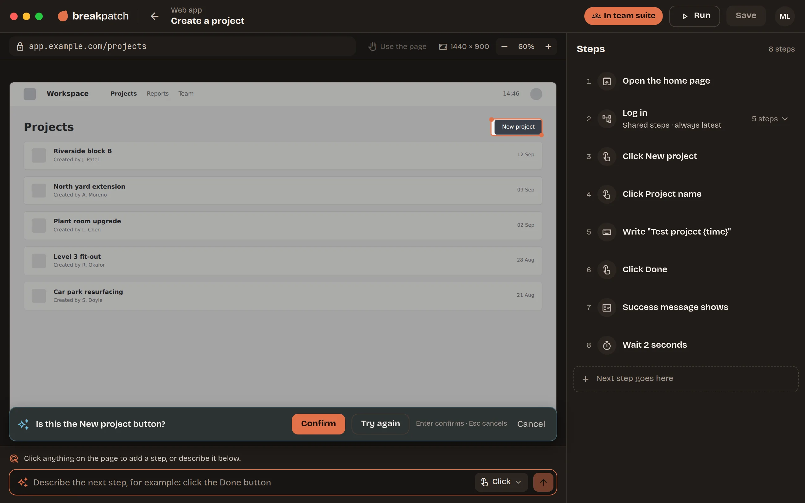
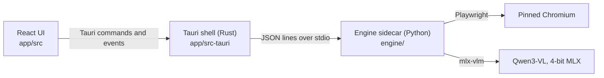

<!--
  Badges. The CI badge (GitHub Actions) and the coverage badges (shields.io reading
  raw.githubusercontent.com/BreakPatch/breakpatch/badges/*.json) read this public repo. The
  coverage files are written to the orphan branch `badges` by the `badges` job in
  .github/workflows/ci.yml on every push to main, with the workflow's own token. The latest
  release badge shows GitHub's Latest release (a beta, until the first stable one). Take the
  "Community: beta" badge out with the first stable release.
-->

<p align="center">
  
</p>

<h1 align="center">
  <picture>
    <source media="(prefers-color-scheme: dark)" srcset="docs/assets/wordmark-dark.svg">
    
  </picture>
</h1>

<p align="center"><strong>Here to find what breaks.</strong></p>

<p align="center"></p>

<p align="center">
  AI-powered UI testing that runs on your Mac. Click through your web app, replay it any time, and see exactly what broke. No code, no selectors, no cloud.*
</p>

<p align="center"><sub>* Mostly sunny, with a light chance of cloud. The AI and your screens never leave your Mac. The internet is only needed to download the AI model and the test browser once, for updates, and for anonymous usage counts you can turn off. Team workspaces (coming later) sync through the cloud, because that's how a team shares tests.</sub></p>

<p align="center">
  <a href="https://github.com/BreakPatch/breakpatch/actions/workflows/ci.yml"></a>
  <a href="https://github.com/BreakPatch/breakpatch/actions/workflows/ci.yml"></a>
  <a href="https://github.com/BreakPatch/breakpatch/actions/workflows/ci.yml"></a>
  <a href="https://github.com/BreakPatch/breakpatch/actions/workflows/ci.yml"></a>
  <br>
  <a href="LICENSE"></a>
  
  <a href="https://github.com/BreakPatch/breakpatch/releases/latest"></a>
</p>

<p align="center">
  <a href="https://breakpatch.dev">Website</a> ·
  <a href="https://breakpatch.dev/docs/">Docs</a> ·
  <a href="https://breakpatch.dev/pricing/">Pricing</a> ·
  <a href="#install">Install</a> ·
  <a href="#for-developers">For developers</a>
</p>

<p align="center">
  <picture>
    <source media="(prefers-color-scheme: light)" srcset="site/assets/shots/recorder-light@2x.webp">
    
  </picture>
  <br>
  <sub>The recorder: your web app on the left, the steps on the right, and the AI on your Mac naming a button.</sub>
</p>

## Install

Open Terminal and paste:

```sh
curl -fsSL https://breakpatch.dev/install | sh
```

The command checks your Mac, downloads the latest release from
[GitHub Releases](https://github.com/BreakPatch/breakpatch/releases), checks it against the
release's checksums, puts Breakpatch in Applications and opens it. It never asks for your password,
and you can [read the script](https://breakpatch.dev/install) first. This command is the only way
to install Breakpatch: there's no disk image to download.

**Breakpatch Community is a beta.** It works, but expect some rough edges. Tell us about problems
in [GitHub issues](https://github.com/BreakPatch/breakpatch/issues) or at
[support@breakpatch.dev](mailto:support@breakpatch.dev). New betas arrive by themselves through
the app's updates.

On first launch you pick a folder for your tests, and setup gets the Mac ready by itself: the test
browser and the AI assistant (about 3 GB, downloaded once). After that, Breakpatch updates itself.

- **A given version:** `curl -fsSL https://breakpatch.dev/install | BREAKPATCH_VERSION=1.2.3 sh`
- **The newest beta:** `curl -fsSL https://breakpatch.dev/install | BREAKPATCH_CHANNEL=beta sh`.
  Until the first stable release the plain command installs the newest beta too; after that,
  without `BREAKPATCH_CHANNEL=beta` you only get stable releases.
- **Uninstall:** `curl -fsSL https://breakpatch.dev/install | sh -s -- --uninstall` (removes the
  app; your tests and saved secrets stay where they are)

Breakpatch is signed with its own certificate, the same one for every release, so updates keep
access to your saved secrets. macOS doesn't quarantine files downloaded with `curl`, so it opens
straight away.

### Requirements

| | |
|---|---|
| Mac | Apple Silicon (M1 or later) |
| Memory | 16 GB or more |
| macOS | 14 Sonoma or later |
| Disk | About 3 GB for the AI assistant, plus the test browser |

Linux comes next, then Windows: see the [roadmap](https://github.com/BreakPatch/breakpatch/issues/48).

## What it does

- **Record by clicking.** Click, drag or draw a box on the page, and the AI names what you clicked:
  steps read “Click New project”, not coordinates, and each keeps a plain *What to look for* that
  you can edit.
- **The AI runs on your Mac.** Qwen3-VL 4B, an open-weights model, on Apple Silicon through MLX.
  Your screens never leave the Mac, there are no API keys and no per-run fees, and it works
  offline once it's downloaded. It's the only model for now: bringing your own local one (through
  Ollama or LM Studio) isn't available yet, and cloud AI models aren't planned.
- **Screen checks you don't set up.** After every step, Breakpatch checks that the screen changed
  the way it did when you recorded it. It's a perceptual comparison, not AI, so the same screen
  always gets the same answer, and it leaves out the parts that change by themselves, like clocks
  and carousels.
- **Know what broke.** The first thing that's wrong stops the run. The report shows what was
  expected next to what was on screen, and why, in plain words, with **Re-record this step** right
  there. **Copy** → **Markdown, for an issue** turns a failed step into a ready-made bug report for
  any tracker.
- **Every action a person does.** Click, double, long and right click, hover, swipe, scroll, drag
  and drop, typing, uploads, downloads, tabs and popups, plus checkpoints, loops, shared steps
  (record *Log in* once, use it everywhere) and suites.
- **Bring your Playwright and Cypress tests.** **Import…** reads a script (never runs it), turns its
  steps into Breakpatch steps, lists what it left out and why, then learns the screens by doing each
  step once.
- **Tests are plain files.** Each test is a readable JSON file in a folder you pick. Keep the folder
  in your project's Git repo and Git is your history.
- **Anything your Mac can open.** Staging behind a VPN, an internal tool or `localhost`, with no
  tunnel.

**Privacy.** Your tests, screenshots and saved secrets stay on your Mac. Breakpatch sends only
anonymous daily usage counts, with no names, addresses, screenshots or IDs. Turn them off in
**Settings → Privacy** or with `BREAKPATCH_NO_USAGE=1`. The documentation's
[Privacy](https://breakpatch.dev/docs/#privacy) section lists exactly what's sent; the code is
in [`usage.rs`](app/src-tauri/src/usage.rs) and [`countUsage.ts`](app/src/data/countUsage.ts).

## Editions

This repository is **Breakpatch Community**: free and open source, and the edition you can install
today. **Breakpatch Team**, the paid edition for teams, is built from a separate private module on
top of this one, and is **coming later**, with **Business** (Team for 20 people or more). Their
prices aren't decided yet: [breakpatch.dev/pricing](https://breakpatch.dev/pricing/) shows what
they'll include, and [support@breakpatch.dev](mailto:support@breakpatch.dev) will tell you when
they're ready. **Solo**, the automation for one person, isn't on sale yet either.

| | Community | Team (coming later) |
|---|---|---|
| Available | Now | Later; no date yet |
| Price | Free, Apache 2.0 | To be decided |
| People | One person, one Mac | Your whole team, with members and roles |
| Recording, AI assistant, screen checks, reports | Yes | Yes |
| Where tests live | JSON files in a folder you pick | A shared workspace, hosted by Breakpatch or in your company's own Firebase project |
| History | The latest version and the last run of each test | Version history with restore, and the team's run history for 90 days |
| When a button moves | The step fails and says why | Fixed automatically: the AI finds it again, and you accept or dismiss the fix |
| When a step fails | The report, with **Copy** as plain text or Markdown for an issue | Also **Why did this fail?** (the AI says what changed) and **Create issue** in GitHub, Linear or Jira |
| Running | By hand: tests and suites (**Run all** for an app) | Also schedules, a local runner, run requests from CI, result messages to Slack, Microsoft Teams or any web address, and the `breakpatch-ci` command line |

The exact line between them is in [docs/editions.md](docs/editions.md). When Team is out, moving to
it keeps your settings, saved secrets and AI assistant, and copies your tests folder into the
workspace.

## Documentation

- **[The documentation](https://breakpatch.dev/docs/)**: installing, recording, running, reading the
  report, shared steps, suites, saved secrets, the AI assistant, privacy and troubleshooting. Its
  source is [docs/manual.md](docs/manual.md).
- [docs/editions.md](docs/editions.md): what's in each edition, and how the code is split.
- [engine/PROTOCOL.md](engine/PROTOCOL.md): the protocol between the app and the engine.
- [engine/README.md](engine/README.md) and [app/src-tauri/README.md](app/src-tauri/README.md): the
  engine and the desktop shell in more depth.

## For developers

### Architecture



| Part | What it does |
|---|---|
| **React UI** (`app/src`) | Every screen: Home, the recorder, the run view and report, suites, setup and settings. TypeScript, Vite and Zustand. It reaches the engine only through the shell. |
| **Tauri shell** (`app/src-tauri`) | The native app: the window, starting and supervising the engine, saved secrets in the Keychain, the updater and the usage counts. For Team it also posts result messages (`runner.rs`) and talks to GitHub, Linear and Jira for Create issue, with each person's token in the Keychain (`trackers.rs`), so the webview's CSP stays strict. Rust and Tauri 2. |
| **Engine sidecar** (`engine/`) | A Python process the shell starts. It drives a pinned Chromium with Playwright through screenshots, mouse and keyboard, records steps and their screen checks, and replays tests. To find a described element it reads the page's accessible names and roles where the page has them, and asks the local model otherwise; the model also reads a described step's meaning when the app's own reading can't (`record.intent`; the recorder's describe box is off for now, `DESCRIBE_STEPS`) and, in Team, explains a failed step (`run.explain`) and suggests a test's steps from a user story (`record.plan`). |
| **Protocol** ([`engine/PROTOCOL.md`](engine/PROTOCOL.md)) | JSON Lines on stdin and stdout: requests with an id, exactly one response per id, and events such as live frames and progress. The shell forwards requests (`engine_request`) and passes events on to the UI. It's the contract: change it there first. |

Screen checks are perceptual hashes of the areas each step affects, with the parts that change by
themselves blanked out. The browser runs at a fixed viewport and scale, so coordinates and hashes
replay the same way every time.

### Repository layout

```
app/                  the desktop app
  src/                React UI: screens/, components/, data/ (storage), engine/ (engine clients), edition/
  src-tauri/          Tauri shell in Rust: src/, tauri.conf.json, capabilities/, icons/
  scripts/            dev-sidecar.sh, a placeholder sidecar that runs engine/.venv
engine/               the Python engine sidecar
  src/breakpatch_engine/   protocol, browser, recorder, runner, screen checks, AI assistant, setup
  tests/              pytest, with local test pages in tests/site/
  PROTOCOL.md         the app ↔ engine contract
scripts/              build-release.sh, build-ci.sh, the install commands' tests, signing and edition helpers
tools/model-test/     compares candidate AI models on real screenshots
docs/                 the documentation's source (manual.md), editions, repository settings
site/                 breakpatch.dev, a static site
```

### Quick start

You need **Node 22**, **Python 3.11** and **Rust** (stable). The full app runs on a Mac; the UI
preview, the engine tests and the shell's checks also run on Linux, with the WebKit development
libraries listed in [`.github/workflows/ci.yml`](.github/workflows/ci.yml).

```sh
git clone https://github.com/BreakPatch/breakpatch.git
cd breakpatch
```

**The UI in a browser**, with a demo workspace and a simulated engine. No Python or Rust needed:

```sh
cd app
npm ci
npm run dev          # then open http://localhost:1420/?demo  (add &ready to skip setup)
```

**The engine**, in its own virtual environment:

```sh
cd engine
python3.11 -m venv .venv
.venv/bin/pip install -e '.[dev]'           # add ,mlx on an Apple Silicon Mac for the AI assistant
.venv/bin/playwright install chromium       # or let the app's setup download it
```

CI and release builds install the exact, hash-checked versions in `engine/locks/` instead
(`pip install --require-hashes`); `scripts/build-release.sh` does too. After changing dependencies
in `engine/pyproject.toml`, run `scripts/lock-python.sh` (needs [uv](https://docs.astral.sh/uv/))
and commit `engine/locks/`, or CI fails with a message saying so.

**The whole app**: Tauri, Vite on port 1420, and the engine from `engine/.venv`:

```sh
cd app
npm run tauri:dev    # writes the dev sidecar, then runs `tauri dev`
```

**The shell on its own**:

```sh
cd app/src-tauri
cargo check && cargo clippy --all-targets -- -D warnings
```

### Running the tests

| Part | Command | Notes |
|---|---|---|
| UI | `cd app && npx vitest run` | Vitest and Testing Library in jsdom. Also `npx tsc -b` and `npm run lint`. |
| Engine | `cd engine && .venv/bin/python -m pytest -q` | About 90 seconds, most of it real headless Chromium. Browser tests are skipped when there's no browser, and nothing touches the network. |
| Shell | `cd app/src-tauri && cargo test` | Run `sh ../scripts/dev-sidecar.sh` once first: the build needs a sidecar file to exist. |
| Install command | `scripts/test-install.sh` | Runs the installer against fake releases, on Linux. |
| breakpatch-ci install command | `scripts/test-install-ci.sh` | The same for `site/install-ci` (needs `python3.11`). |

Coverage, measured the way CI measures it for the badges:

```sh
cd app && npx vitest run --coverage                  # summary in app/coverage/
cd engine && .venv/bin/python -m pytest -q --cov     # follows the engine into its child processes
cd app/src-tauri && cargo llvm-cov                   # needs cargo-llvm-cov and llvm-tools-preview
```

CI ([`.github/workflows/ci.yml`](.github/workflows/ci.yml)) runs all of them on every pull request,
plus a Community release build on Linux.

### Building

To build the app the way releases are built, run one script from the repo root:

```sh
scripts/build-release.sh --edition community
```

It builds the engine sidecar (PyInstaller), the frontend and then the Tauri app, and checks that
each part is the Community edition. On a Mac you get `Breakpatch.app` in
`app/src-tauri/target/release/bundle/`; elsewhere, the app binary (`--no-bundle`, or
`--bundles deb` for a Debian package). Without signing keys in the environment the Mac build is
signed ad hoc, which is fine to try but not to share. `scripts/build-release.sh --help` lists the
options, and [app/src-tauri/README.md](app/src-tauri/README.md#code-signing) explains signing.

The script has two halves, which the release workflow runs as separate steps so that no
third-party install code runs next to the signing keys: `--deps-only` installs everything (the
hashed Python lock, `npm ci --ignore-scripts`, `cargo fetch --locked`) and refuses to run with
signing variables set, and `--no-deps` builds offline with what's installed. Without either flag
it runs both.

### Releases, CI and the website: owner settings

The workflows expect these GitHub settings; the release and the website don't deploy until they
exist.

- **Environment `release`** (Settings → Environments): required reviewer, deployment refs tags
  `v*` only, holding the secrets `TAURI_SIGNING_PRIVATE_KEY`, `TAURI_SIGNING_PRIVATE_KEY_PASSWORD`,
  `BP_CODESIGN_P12`, `BP_CODESIGN_P12_PASSWORD` and `TEAM_REPO_TOKEN`. Delete the repository-level
  copies once they're in it. Manual runs of the Release workflow are unsigned Community test
  builds with no secrets.
- **Environment `website`**: deployment branch `main`, holding `FIREBASE_HOSTING_SERVICE_ACCOUNT`.
- **Move the website to its own Firebase project** (an owner step, security review C4). The site
  `breakpatch-web` lives in the back office's project `breakpatch-backoffice`, and the role
  "Firebase Hosting Admin" covers every Hosting site in a project, so the website's deploy account
  can also replace the back office app and `/install`. With its own project, change `--project`
  in `.github/workflows/website.yml` and the service account in the `website` environment.
- `.github/CODEOWNERS` asks the owner to review workflows, scripts, the shell, the install
  script, dependencies and lock files; turn on "Require review from Code Owners" in the `main`
  ruleset for it to be enforced. The actions are pinned to commit SHAs. Dependabot's update pull
  requests are taken together, tested locally, in one bundle commit rather than one merge each,
  to save Actions minutes.

### Betas and updates

The release workflow (`.github/workflows/release.yml`, the publish job) decides what the install
command and the in-app updater see. Both read GitHub's **Latest** release: the plain command asks
for `releases/latest`, and the updater reads `releases/latest/download/latest.json`
(`app/src-tauri/tauri.conf.json`). GitHub never makes a prerelease Latest, so:

- **Until the first stable release**, a beta tag (`v0.1.0-beta.1`, with a `-`) is published as a
  normal release marked Latest. `curl -fsSL https://breakpatch.dev/install | sh` installs it, and
  installed betas update to the next one (0.1.0-beta.2 is newer than 0.1.0-beta.1) and then to
  the first stable release (0.1.0 is newer than any 0.1.0 beta).
- **Once a stable release exists**, beta tags are published as GitHub prereleases, never Latest:
  stable copies never see them. `BREAKPATCH_CHANNEL=beta` takes the newest release, betas
  included; `BREAKPATCH_VERSION=0.2.0-beta.1` a given one.
- The job checks the result (a beta that should be Latest and isn't, or a prerelease that became
  Latest, fails it), and takes the release notes from `docs/releases/<tag>.md` at the tagged
  commit when there is one. `scripts/test-install.sh` runs the job's script against a stand-in
  for `gh`.
- The tag must match `app/package.json`, `app/src-tauri/Cargo.toml` and
  `engine/src/breakpatch_engine/__init__.py` (the release workflow checks);
  `engine/pyproject.toml` has the PEP 440 spelling (`0.1.0b1`).

`BREAKPATCH_GITHUB_TOKEN`, which the install commands take, was for the private beta while the
repository was private. It isn't needed now.

### Roadmap

What's planned, in order: [the roadmap overview (#48)](https://github.com/BreakPatch/breakpatch/issues/48).
Every item is a
[GitHub issue with the `roadmap` label](https://github.com/BreakPatch/breakpatch/issues?q=is%3Aissue+label%3Aroadmap).

### Contributing

Issues and pull requests are welcome. Read [CONTRIBUTING.md](CONTRIBUTING.md) first: it covers
setting up, the product's voice for UI text, tests, and the few things we won't merge (such as
CSS or XPath selectors: pixels decide, and page structure is only used to find things).

### Security

Please don't report security problems in public issues. Email
[support@breakpatch.dev](mailto:support@breakpatch.dev) instead; [SECURITY.md](SECURITY.md) has the
details.

## Licence

[Apache 2.0](LICENSE). The AI model, Qwen3-VL by the Qwen team, is Apache 2.0 too.

The ear mark is Mora's, our brindle dog, who also finds things that are broken.
